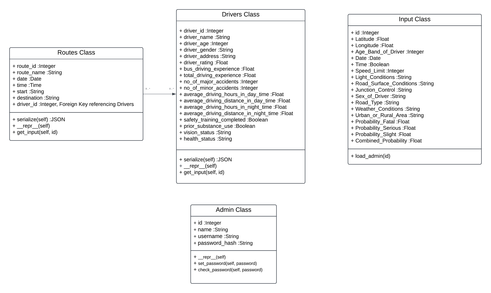

# BACKEND DOCUMENTATION


Folder Structure
```app/
  __init__.py
  models.py
  routes.py
data/
migrations/
  README
  alembic.ini
  env.py
notebooks/
  models.ipynb
.flaskenv
README.md
backend.py
config.py
```


## Folder specific Documentation

### 1 - app
#### 1.1 __init__.py
-	**Purpose**:-
		The __init__.py file initializes the Flask application and configures the essential extensions SQLAlchemy, Flask-Migrate for database migrations, and Flask-Login for user authentication.
- **Dependencies**:-
		Flask: The main Flask web framework. 
    SQLAlchemy: ORM for database operations. 
    Flask-Migrate: Extension for handling database migrations. 
    Flask-Login: Extension for managing user authentication.


#### 1.2 models.py
- 	**Purpose**:-
		The models.py file defines the data models for the application using SQLAlchemy. It describes the structure of the database tables, including the entities Admin, Drivers, Routes, and Input.

- **Class Diagram**:-
  

-	**Models**:-
	-	**Admin**:-
		-	**Purpose**:
          The Admin class represents entities for admin users in the application. Each instance of this class corresponds to a unique admin user with attributes such as name, username, and a hashed password.

    - **Attributes**:

      - **`id` (Integer):** Unique identifier for the admin user.
      - **`name` (String):** Full name of the admin user.
      - **`username` (String):** Username of the admin user (indexed and unique).
      - **`password_hash` (String):** Hashed password of the admin user.

    - **Methods**:

      - **`__repr__() -> str`:**
        - Returns a string representation of the `Admin` object.
        - Example: `"User id: 1\nUser name: John Doe\nUser username: john_doe"`

      - **`set_password(password: str) -> None`:**
        - Sets the password for the admin user.
        - Parameters:
          - `password` (str): The password to be hashed and stored.
        - No return value.

      - **`check_password(password: str) -> bool`:**
        - Checks if the provided password matches the stored hash.
        - Parameters:
          - `password` (str): The password to be checked.
        - Returns:
          - `True` if the password is correct.
          - `False` otherwise.


  - **Drivers**:-
			Represents driver entities with various attributes. Each instance of this class corresponds to a unique driver with various attributes such as name, age, driving experience, and safety-related information.
    - **Attributes**: 
        driver_id (Integer): Unique identifier for the driver. 
        driver_name (String): Name of the driver. 
        driver_age (Integer): Age of the driver. 
        driver_gender (String): Gender of the driver. 
        driver_address (String): Address of the driver. 
        driver_rating (Float): Rating of the driver. 
        bus_driving_experience (Float): Experience in driving buses. 
        total_driving_experience (Float): Total driving experience. 
        no_of_major_accidents (Integer): Number of major accidents. 
        no_of_minor_accidents (Integer): Number of minor accidents. 
        average_driving_hours_in_day_time (Float): Average driving hours during the day.
        average_driving_distance_in_day_time (Float): Average driving distance during the day. 
        average_driving_hours_in_night_time (Float): Average driving hours during the night. 
        average_driving_distance_in_night_time (Float): Average driving distance during the night. 
        safety_training_completed (Boolean): Indicates whether safety training is completed.
        prior_substance_use (Boolean): Indicates prior substance use. 
        vision_status (String): Vision status of the driver. 
        health_status (String): Health status of the driver. 

    - **Methods**:
        - **`serialize() -> dict`**: Serializes the Drivers object into a dictionary for easy representation or API responses. 
          - Returns: A dictionary containing driver attributes.
        - **`__repr__() -> str`**: Returns a string representation of the Drivers object. Example: '<Drivers 1>' 
        - **`get_input(id: int) -> None`**: Gets user input to update attributes of an existing driver instance identified by id. 
            Parameters: 
            `id (int)`: The unique identifier of the driver. 
                  User is prompted to input values for string, integer, boolean, and float attributes.


  - **Routes**: 
      Represents entities for routes in the application. Each instance of this class corresponds to a unique route with attributes such as route name, date, time, start location, destination, and the associated driver.

    -  **Attributes**:

      - **`route_id` (Integer):** Unique identifier for the route.
      - **`route_name` (String):** Name of the route (indexed).
      - **`date` (Date):** Date of the route.
      - **`time` (Time):** Time of the route.
      - **`start` (String):** Starting location of the route.
      - **`destination` (String):** Destination of the route.
      - **`driver_id` (Integer):** Foreign key referencing the driver associated with the route.

    - **Methods**:

      - **`__repr__() -> str`:**
        - Returns a string representation of the `Routes` object.
        - Example: `'<Routes 1>'`

      - **`serialize() -> dict`:**
        - Serializes the `Routes` object into a dictionary for easy representation or API responses.
        - Returns: A dictionary containing route attributes.

      - **`get_input(id: int) -> None`:**
        - Gets user input to update attributes of an existing route instance identified by `id`.
        - Parameters:
          - `id` (int): The unique identifier of the route.
        - User is prompted to input values for string, date, time, and integer attributes.
      

  - **Load_admin function**:- 

      The `load_admin` function is a user loader used by Flask-Login to load an admin user based on the provided user ID. It queries the database to retrieve the admin user with the specified ID.

    - **Parameters**:

      - **`id` (int):** The user ID of the admin user to be loaded.

    - **Returns**:

      - **`Admin`:** The loaded admin user instance.

  - **Input**: 
    Represents input data entities.

#### 1.3 routes.py:-

  #### `/` - Test Route

  - **Method:** `GET`
  - **Purpose:** Test endpoint to check if the server is running.
  - **Response:** Returns a JSON object with a "hello, world" message.

  #### `/test_database_connection` - Test Database Connection

  - **Method:** `GET`
  - **Purpose:** Test endpoint to check the connection to the database.
  - **Response:**
    - If successful: Returns a JSON object indicating a successful database connection with the database version.
    - If failed: Returns a JSON object with an error message.

  #### `/test_model_status` - Test Model Status

  - **Method:** `GET`
  - **Purpose:** Test endpoint to check the status of the machine learning model.
  - **Response:**
    - If the model is loaded: Returns a JSON object indicating that the model is loaded and ready for predictions.
    - If loading failed: Returns a JSON object with an error message.

  #### `/login` - User Login

  - **Method:** `POST`
  - **Parameters:**
    - `username` (String): The username of the user attempting to log in.
    - `password` (String): The password of the user attempting to log in.
    - `remember_me` (Boolean): Flag indicating whether to remember the user's login status.
  - **Purpose:** Authenticates the user and logs them in if credentials are valid.
  - **Response:**
    - If successful: Returns a JSON object indicating a successful login.
    - If failed: Returns a JSON object with an error message.

  #### `/logout` - User Logout

  - **Method:** `GET`
  - **Purpose:** Logs out the currently authenticated user.
  - **Response:** Returns a JSON object indicating a successful logout.

  #### `/driver/<int:driver_id>/` - Get Driver Information

  - **Method:** `GET`
  - **Parameters:**
    - `driver_id` (Integer): The ID of the driver.
  - **Purpose:** Retrieves information about a specific driver.
  - **Response:**
    - If successful: Returns a JSON object with serialized information about the driver.
    - If failed: Returns a JSON object with an error message.

  #### `/route/<int:route_id>/` - Get Route Information

  - **Method:** `GET`
  - **Parameters:**
    - `route_id` (Integer): The ID of the route.
  - **Purpose:** Retrieves information about a specific route.
  - **Response:**
    - If successful: Returns a JSON object with serialized information about the route.
    - If failed: Returns a JSON object with an error message.

#### `/predict` - Predict Accident Probabilities

- **Method:** `POST`
- **Parameters:**
  - JSON object with input data for the machine learning model.
- **Purpose:** Predicts accident probabilities using a machine learning model.
- **Response:**
  - If successful: Returns a JSON object with predicted class and probabilities.
  - If failed: Returns a JSON object with an error message.

### Migrations:-
  #### Purpose:

  - The `migrations` folder manages database migrations for your Flask application. It stores scripts that represent changes to the database schema over time. These scripts are generated and managed by Flask-Migrate.

  #### Structure:

  - **`versions` Folder:**
    - Contains numbered migration script files. Each file represents a specific database schema change.
    - The naming convention is typically a timestamp followed by a brief description of the changes.

  - **`alembic.ini` File:**
    - Configuration file for Alembic, the migration framework used by Flask-Migrate.
    - Configures the database connection URI and other Alembic settings.

  - **`env.py` File:**
    - Configuration script for Alembic. Specifies how to locate and use the database models.

  - **`script.py.mako` File:**
    - Mako template for generating new migration scripts. It includes placeholders for database changes.

  #### Workflow:

  1. **Create a Migration:**
    - Run the `flask db migrate` command to generate a new migration script based on changes in your models.

  2. **Review and Modify:**
    - Inspect the generated migration script in the `versions` folder.
    - Make any necessary adjustments to the script to reflect your desired changes.

  3. **Apply the Migration:**
    - Run the `flask db upgrade` command to apply the migration and update the database schema.
